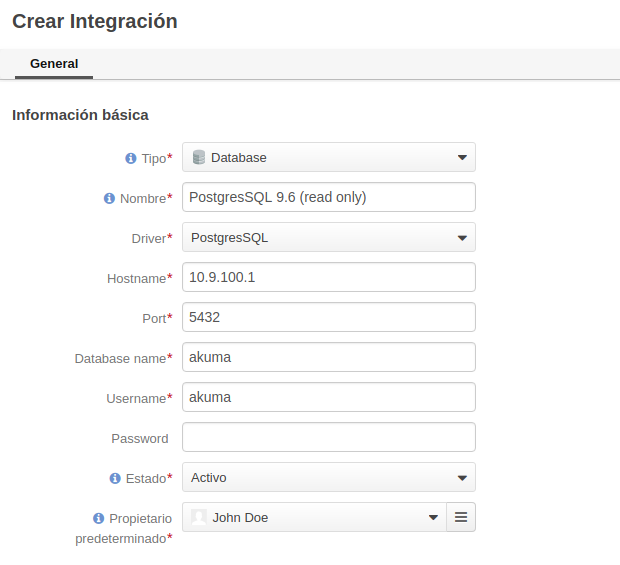
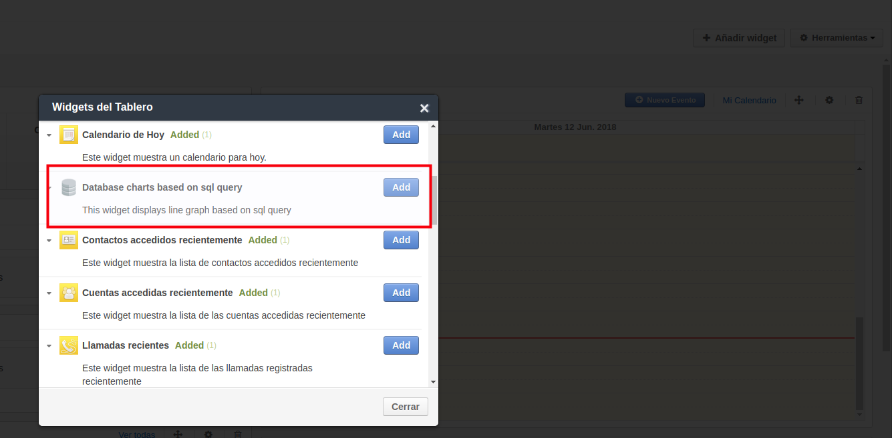
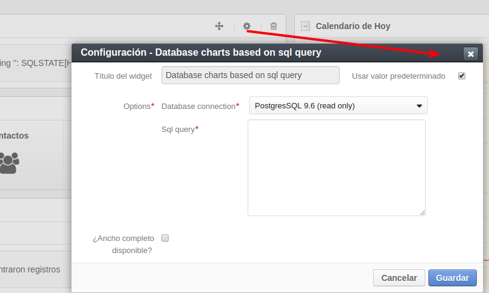
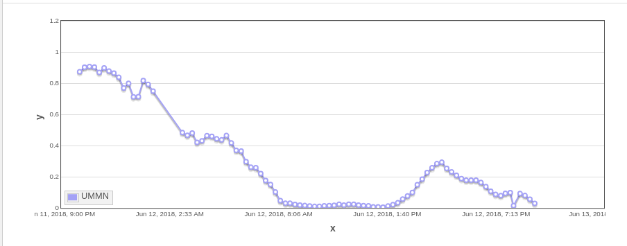
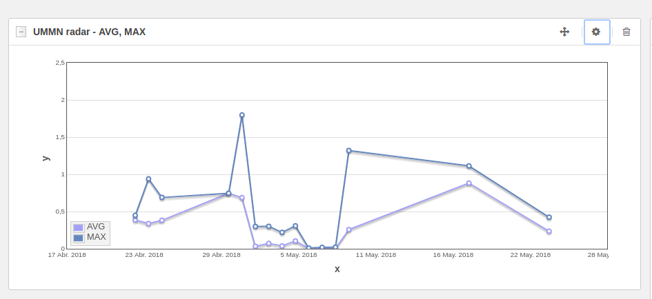
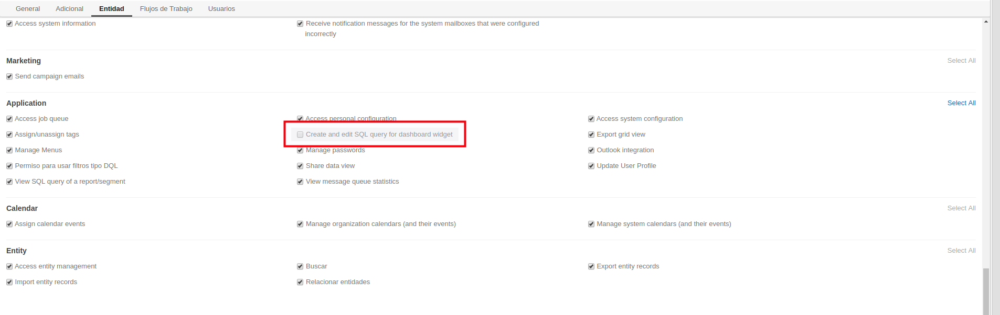

# GraphWidgetBundle for OroPlatform

This OroPlatform bundle provider functionality to build line graph based on custom native sql query.

## Install
Install using [composer][1] following the official Composer [documentation][2]: 

1. Install via composer:
```
composer require okvpn/graph-widget-bundle
```

2. Run oro platform update

```
# symfony 3
rm -r var/cache/*
php bin/console oro:platform:update --force

# symfony 2
rm -r app/cache/*
php app/console oro:platform:update --force
```

## Configure

1. Create database integration.

**Note:** it's better to create a read-only database user. Dashboard widget use separate connection for database.

[](src/Resources/docs/1.png)

2. Add widget to dashboard.

[](src/Resources/docs/2.png)

3. Update widget configuration

[](src/Resources/docs/3.png)

## SQL Format

You can build line or multi-line plot. The data will be fetch from the columns: "x", "y", "line".
Where: "x" - x-axis, "y" - y-axis and "line" - grouping column to build multi-line plot.

### Example of line plot. 
```sql
SELECT avg_status as y, created_at as x
FROM okvpn_radar
WHERE time > extract(epoch from now()) - 86400
ORDER BY id DESC LIMIT 1000;
```

*Results of execute sql query*

| x    |       y            |
|------|--------------------|
|0.005 |2018-06-12 18:42:00 |
|0.013 |2018-06-12 18:27:00 |
|0.030 |2018-06-12 18:12:00 |
|0.056 |2018-06-12 17:57:00 |
|0.081 |2018-06-12 17:42:00 |

[](src/Resources/docs/4.png)

### Example of multi-line plot.

```sql
SELECT tmp.x, tmp.y, tmp.line FROM (
  SELECT ROUND(AVG(avg_status), 3) AS y, created_at::date AS x, 'AVG' AS line
  FROM okvpn_radar
  WHERE created_at > now() - INTERVAL '50 day' AND type = 'UMMN' GROUP BY x
  UNION ALL (
    SELECT ROUND(MAX(avg_status), 3) AS y, created_at::date AS x, 'MAX' AS line
    FROM okvpn_radar
    WHERE created_at > now() - INTERVAL '50 day' AND type = 'UMMN' GROUP BY x
  )
) tmp ORDER BY tmp.x DESC;
```

*Results of execute sql query*

|    x     |  y    |line|
|----------|-------|----|
|2018-06-12| 0.157 |AVG |
|2018-06-12| 0.484 |MAX |
|2018-06-11| 1.164 |MAX |
|2018-06-11| 0.478 |AVG |
|2018-06-10| 0.018 |MAX |
|2018-06-10| 0.004 |AVG |

[](src/Resources/docs/5.png)

## Permissions

You can disable update sql query using ACL permission `okvpn_sql_query`.

[](src/Resources/docs/6.png)

License
-------
MIT License. See [LICENSE](LICENSE).

[1]:    https://getcomposer.org/
[2]:    https://getcomposer.org/download/
